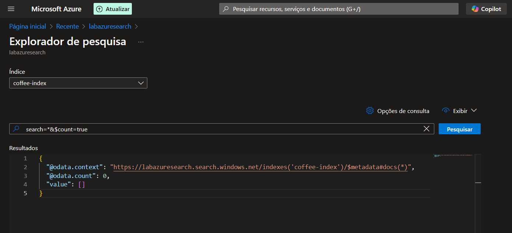
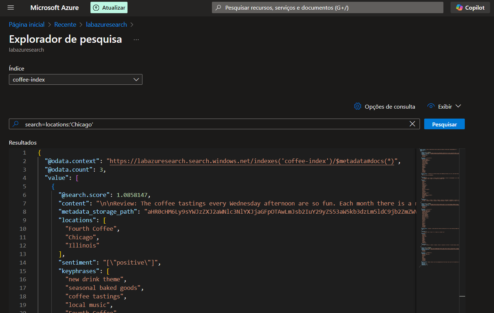

<h1>Azure Cognitive Search: Utilizando AI Search para indexação e consulta de Dados</h1>

<h3>Repositório criado para o desafio do bootcamp Microsoft - Fundamentos de IA</h3>

<h4 align="justify">Descrição do projeto</h4>

   Este projeto demonstra como configurar e usar o Azure Cognitive Search (AI Search) para indexar e consultar dados utilizando inteligência artificial. Durante o processo, configuramos serviços no Azure, carregamos um dataset de avaliações de café (coffee-reviews) e realizamos consultas no índice criado.

    O objetivo é mostrar o potencial do Azure Cognitive Search para processar e analisar grandes volumes de dados, extraindo insights e facilitando consultas rápidas e relevantes.

 

<h2>Configuração e Etapas do Projeto</h2>

<h3>1. Criar o Recurso AI Search</h3>
<ol>
    <li>Acesse o portal do Azure e vá até Azure AI Services.
    <li>Clique em Criar e selecione AI Search.
    <li>Preencha os campos necessários (nome, região, etc.) e finalize a criação do recurso.
</ol>

<h3>2. Configurar o Azure Storage</h3>
<ol>
    <li>No menu principal do Azure, vá para Storage Accounts.
    <li>Crie uma conta de armazenamento com as configurações padrão.
    <li>Dentro da conta de armazenamento, crie um container público.
    <li>Faça o upload do arquivo coffee-reviews.zip para o container.
</ol>

<h3>3. Importar Dados no AI Search</h3>
<ol>
    <li>Retorne ao recurso AI Search e clique em Import Data.
    <li>Configure a conexão com o container do Azure Storage.
    <li>Defina o mapeamento das colunas do arquivo com os campos no índice.
</ol>

<h3>4. Indexar os Dados</h3>
<ol>
    <li>Crie o índice definindo os campos e tipos de dados.
    <li>Execute o processo de indexação e aguarde a conclusão.
</ol>

<h3>5. Consultar o Índice</h3>
<ol>
    <li>Use o console integrado no AI Search para realizar consultas básicas.
    <li>Experimente filtros e buscas semânticas para explorar o potencial da ferramenta.
</ol>

<h2>Benefícios do Azure Cognitive Search</h2>

    <ul>
        <li>Análise semântica: Entende a intenção por trás das consultas, retornando resultados mais relevantes.
        <li>Indexação poderosa: Suporta grandes volumes de dados estruturados e não estruturados.
        <li>Escalabilidade: Ideal para aplicações web, sistemas de busca corporativos e comércio eletrônico.
        <li>Integração: Fácil integração com outros serviços da Azure e ferramentas de análise.
    </ul>

<h2>Possibilidades de Aplicação</h2>

    <ul>
        <li>E-commerce: Busca avançada por produtos e recomendações personalizadas.
        <li>Educação: Ferramentas de busca inteligente para materiais de estudo.
        <li>Saúde: Pesquisa rápida em bancos de dados médicos para suporte clínico.
    </ul>

<h2>Aprendizados e Desafios</h2>

<h3>Aprendizados</h3>
<ul>
    <li>Configuração e uso de ferramentas do Azure para IA.
    <li>Compreensão do fluxo de trabalho do Azure Cognitive Search.
    <li>Importância da estruturação e indexação de dados.
</ul>

<h3>Desafios</h3>
<ul>
    <li>Configuração inicial do Azure Storage.
    <li>Entendimento de mapeamentos entre os dados do container e o índice.
</ul>

<h2>Recursos e Links</h2>
<ul>
    <li><a href="https://microsoftlearning.github.io/mslearn-ai-fundamentals/Instructions/Labs/11-ai-search.html">Laboratório do Microsoft Learn</a>
    <li><a href="https://learn.microsoft.com/en-us/azure/search/">Documentação do Azure Cognitive Search</a>
    <li><a href="https://microsoftlearning.github.io/mslearn-ai-fundamentals/Instructions/Labs/11-ai-search.html#upload-documents-to-azure-storage">Laboratório realizado</a>
    <li><a href="/coffee-reviews/">Dataset usado no projeto</a>
</ul>

<h2>Capturas de Tela</h2>

<figure align="center">
    
    <figcaption>Filtrando os índices.</figcaption>
</figure>

<figure align="center">
    
    <figcaption>Filtro de localização: Chicago.</figcaption>
</figure>